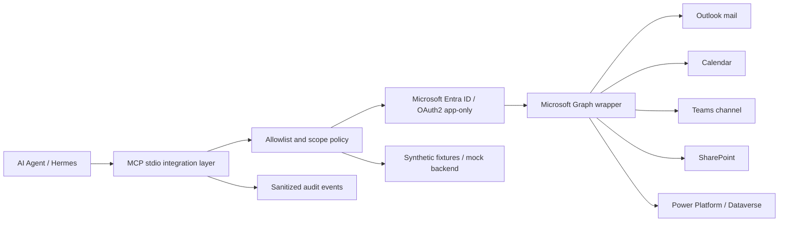

# Microsoft 365 Agent Integration

[](https://github.com/nerdylog-code/microsoft-365-agent-integration/actions/workflows/ci.yml)
[](LICENSE)

> **Architecture boundary:** real enterprise integration pattern → sanitized clean-room public implementation → synthetic fixtures → reproducible tests. The public repository never contacts a Microsoft 365 tenant by default.

## Project

Sanitized integration between an AI agent and Microsoft 365 services using MCP, Microsoft Graph, Microsoft Entra ID, and OAuth.

## Problem

Corporate workflows distribute information across Outlook, calendars, Teams, SharePoint, and Power Platform. Manual access creates repeated navigation, context switching, and difficulty automating tasks with a controlled permission boundary.

## Solution

A small integration layer lets an agent discover and execute explicitly authorized tools while respecting the scopes and permissions configured in Microsoft Entra ID. This repository is a clean-room reference implementation: it preserves the observed architecture and safety contracts without copying private source, identifiers, credentials, or corporate payloads.

## Security

No credential or corporate data is included. The public version uses placeholders, synthetic fixtures, deterministic mocks, redacted audit records, and read-only behavior by default. Remote write operations are not exposed by the public MCP runtime.

## Architecture



The public code does not claim that one permission grants access to every service. Each service is listed independently and must be configured in the consumer's own tenant.

## What the real implementation showed

The reference architecture separates custom MCP servers for mail, calendar, Teams channel reads, SharePoint reads, controlled draft/action paths, and a pinned Power Platform development scope. The public implementation preserves these boundaries as documentation and clean-room contracts; it does not publish private source, identifiers, credentials, or corporate payloads.

The architecture uses MCP over stdio, Microsoft Graph, OAuth2 client credentials, fixed or operator-configured identities outside tool arguments, bounded pagination, host allowlisting, and sanitized audit records. These are design references, not claims that the public repository has access to a live tenant.

## MCP distinction

This is not the Microsoft Enterprise MCP product. The observed integration was a set of custom MCP servers written for a specific operator workflow. Hermes supplies the MCP host/client capability; the Microsoft layer owns the tool schemas, Graph calls, identity boundary, permission policy, and redaction rules.

## Public tool surface

The clean-room mock runtime publishes these bounded tools:

| Tool | Service | Public behavior |
|---|---|---|
| `calendar_agenda` | Calendar | Synthetic bounded agenda with conflict detection |
| `mail_list_inbox` | Outlook | Synthetic message metadata; no mailbox selector |
| `mail_prepare_draft` | Outlook | Local preview only; never writes or sends |
| `teams_channel_history` | Teams | Synthetic history for logical aliases |
| `teams_channel_digest` | Teams | Classifies only explicit leading markers |
| `sharepoint_list_folder` | SharePoint | Synthetic metadata listing |
| `sharepoint_read_document` | SharePoint | Bounded synthetic UTF-8 document read |
| `powerplatform_list_flows` | Dataverse | Synthetic development-scope metadata |

`tools/list` and `tools/call` are exercised through the included stdio contract. The mock backend is intentionally the default so a clone-and-test run never contacts Microsoft 365.

## Status boundary

| Capability | Status | Meaning |
|---|---|---|
| MCP initialize / `tools/list` / controlled `tools/call` | `IMPLEMENTED_AND_VERIFIED` | Tested locally against the clean-room runtime |
| Graph OAuth2 client-credentials wrapper | `IMPLEMENTED_AND_VERIFIED` | Tested with injected HTTP transports; no secret is required |
| Graph 401/403/429/timeout/invalid JSON handling | `IMPLEMENTED_AND_VERIFIED` | Tested offline |
| Outlook read architecture | `IMPLEMENTED_NOT_RETESTED` | Confirmed in private source evidence; public code uses synthetic fixtures |
| Calendar read architecture | `IMPLEMENTED_NOT_RETESTED` | Confirmed in private source evidence; remote smoke is not claimed |
| Teams channel read architecture | `IMPLEMENTED_NOT_RETESTED` | Confirmed in private source evidence; RSC is tenant-specific |
| SharePoint read architecture | `IMPLEMENTED_NOT_RETESTED` | Confirmed in private source evidence; IDs are not published |
| Power Platform/Dataverse | `DOCUMENTED_ONLY` | Private evidence exists; no corporate endpoint is included here |
| Delegated Microsoft OAuth | `NOT_SUPPORTED` | The observed Microsoft path was app-only client credentials |
| Remote Microsoft write operations | `NOT_SUPPORTED` | Deliberately excluded from the public runtime |

## Permission model

The public project does not grant permissions. For an optional tenant integration, request only the scopes required by the tools you actually implement. Typical private implementation categories were:

- Microsoft Graph application access for bounded mail/calendar reads;
- Exchange Application RBAC to restrict mailbox scope;
- Teams Resource-Specific Consent for approved resources;
- SharePoint site/drive allowlists;
- a separate, pinned Power Platform development environment.

Do not replace a missing resource authorization with a tenant-wide permission. See [`docs/permissions.md`](docs/permissions.md).

## Quickstart with mocks

Requirements: Python 3.11–3.13 and `uv`.

```bash
uv venv
uv pip install -e '.[dev]'
uv run pytest --cov
uv run python scripts/scan_secrets.py
uv run m365-mcp-stdio --mock
# Optional official MCP Python SDK transport:
uv run m365-mcp-sdk-stdio
```

The stdio process accepts MCP JSON-RPC requests. A minimal handshake sequence is:

```json
{"jsonrpc":"2.0","id":1,"method":"initialize","params":{"protocolVersion":"2025-06-18","capabilities":{},"clientInfo":{"name":"demo","version":"0.1.0"}}}
{"jsonrpc":"2.0","method":"notifications/initialized","params":{}}
{"jsonrpc":"2.0","id":2,"method":"tools/list","params":{}}
```

The repository's tests exercise the same contract without requiring a terminal session or Microsoft account.

## Optional tenant integration

This repository does not ship a live tenant adapter or private IDs. A consumer with its own tenant can reuse the typed Graph client and provide its own:

```text
MSGRAPH_TENANT_ID=<AZURE_TENANT_ID>
MSGRAPH_CLIENT_ID=<AZURE_CLIENT_ID>
MSGRAPH_CLIENT_SECRET=<CLIENT_SECRET_NOT_INCLUDED>
MSGRAPH_MAILBOX=<TEST_USER_EMAIL>
```

Keep values in an environment/credential manager. Do not add them to `config.yaml`, fixtures, logs, issues, or pull requests. A live adapter must add a service-specific allowlist and read-only tests before any remote call is enabled.

## Evidence and tests

The `evidence/` directory contains generated, sanitized summaries only. It must never contain message bodies, document contents, access tokens, tenant IDs, mailbox addresses, or private Graph IDs.

Local gates:

```bash
uv run python -m compileall -q src tests
uv run ruff check src tests scripts
uv run pytest --cov
uv run bandit -q -r src
uv run pip-audit
uv run python scripts/scan_secrets.py
```

GitHub Actions runs the same categories. The hosted workflow has a successful public run on the current baseline (`5b27184`): [CI run 35607900068](https://github.com/nerdylog-code/microsoft-365-agent-integration/actions/runs/35607900068). This verifies the clean-room test pipeline only; it does not verify authorization in a Microsoft tenant.

## Limitations

- Synthetic fixtures prove contracts, not a live tenant's current permissions.
- The public repository does not reproduce private mailbox, SharePoint, Teams, or Dataverse identifiers.
- Remote permission behavior depends on Entra consent, Exchange RBAC, Teams RSC, and tenant policy.
- Power Apps/Dataverse is not exposed as a live public connector.
- No email, event, Teams message, SharePoint item, or Dataverse record is created by the default runtime.

## License

MIT. See [`LICENSE`](LICENSE).
